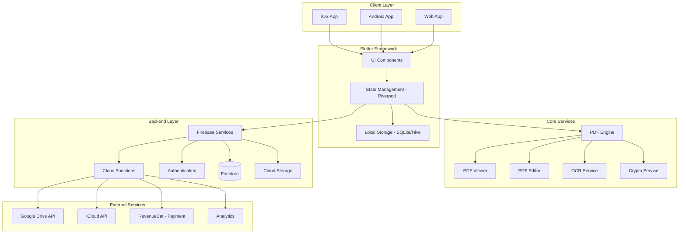
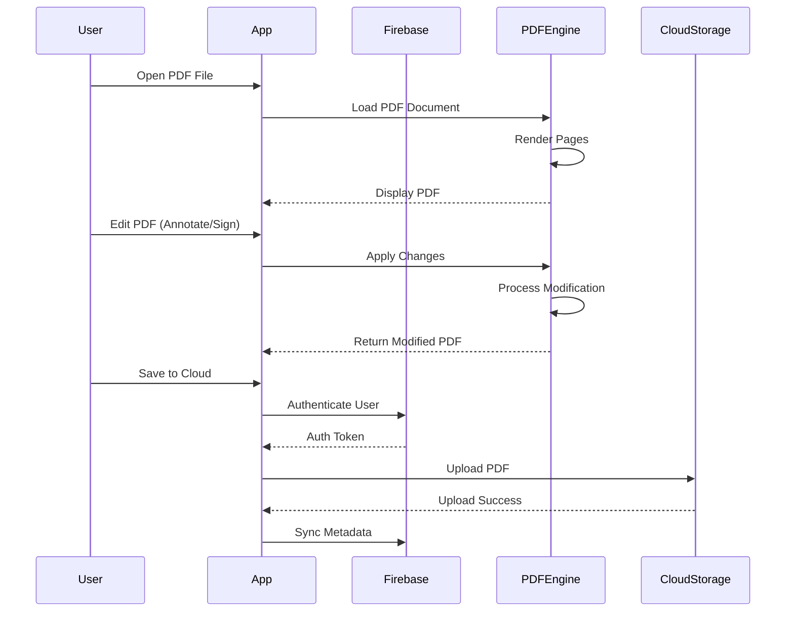
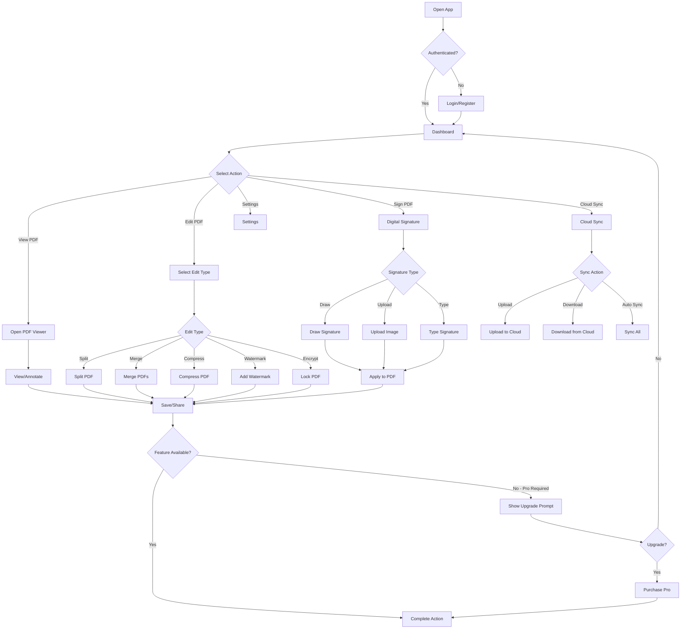
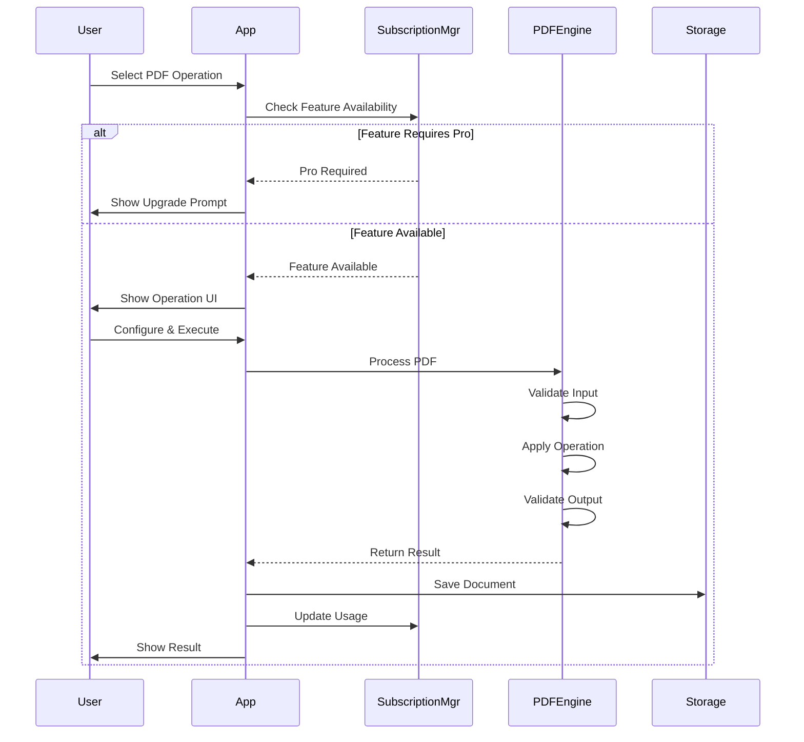
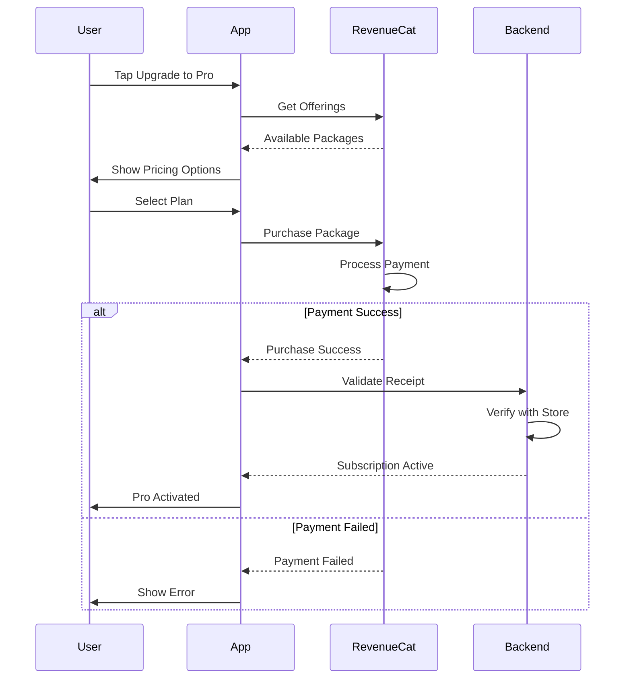

# Design Document: PDF Enterprise Suite

## Overview

PDF Enterprise Suite adalah aplikasi PDF all-in-one cross-platform (iOS, Android, Web) dengan model freemium yang dirancang untuk kebutuhan enterprise namun tetap mudah diimplementasi. Aplikasi ini menyediakan fitur lengkap untuk mengelola dokumen PDF termasuk viewing, editing, signing, dan sharing dengan integrasi cloud storage.

Aplikasi dibangun menggunakan Flutter untuk cross-platform compatibility, dengan Firebase sebagai backend untuk autentikasi, database, dan storage. Model freemium memungkinkan pengguna mencoba fitur basic secara gratis dengan batasan penggunaan, sementara fitur advanced memerlukan subscription Pro.

---

## Architecture

### System Architecture Diagram



### High-Level Flow




---

## Components and Interfaces

### Component 1: PDF Viewer Engine

**Purpose**: Render dan menampilkan dokumen PDF dengan performa tinggi, mendukung smooth scrolling dan zoom.

**Interface**:
```dart
abstract class PDFViewerEngine {
  /// Load PDF document from file path or URL
  Future<PDFDocument> loadDocument(String source);
  
  /// Render specific page to image
  Future<Uint8List> renderPage(int pageIndex, {double scale = 1.0});
  
  /// Get document metadata (page count, title, author, etc.)
  Future<PDFMetadata> getMetadata();
  
  /// Stream page rendering progress
  Stream<double> get renderProgress;
  
  /// Dispose resources
  void dispose();
}
```

**Responsibilities**:
- Load dan parse dokumen PDF
- Render halaman secara efisien dengan caching
- Menangani zoom dan scroll gestures
- Memory management untuk dokumen besar

### Component 2: PDF Editor Engine

**Purpose**: Memproses modifikasi PDF termasuk split, merge, compress, dan watermark.

**Interface**:
```dart
abstract class PDFEditorEngine {
  /// Split PDF into multiple files
  Future<List<PDFDocument>> split(PDFDocument source, SplitConfig config);
  
  /// Merge multiple PDFs into one
  Future<PDFDocument> merge(List<PDFDocument> documents, MergeConfig config);
  
  /// Compress PDF to reduce file size
  Future<PDFDocument> compress(PDFDocument source, CompressConfig config);
  
  /// Rotate pages
  Future<PDFDocument> rotatePages(PDFDocument source, Map<int, int> rotations);
  
  /// Reorder pages
  Future<PDFDocument> reorderPages(PDFDocument source, List<int> newOrder);
  
  /// Add watermark
  Future<PDFDocument> addWatermark(PDFDocument source, WatermarkConfig config);
  
  /// Lock/Encrypt PDF with password
  Future<PDFDocument> encrypt(PDFDocument source, EncryptConfig config);
}
```

**Responsibilities**:
- Memproses operasi PDF manipulation
- Menjaga kualitas dokumen setelah editing
- Optimasi performa untuk file besar
- Error handling dan validation

### Component 3: Annotation Engine

**Purpose**: Mengelola annotasi, highlight, dan catatan pada PDF.

**Interface**:
```dart
abstract class AnnotationEngine {
  /// Add annotation to specific page
  Future<Annotation> addAnnotation(int pageIndex, AnnotationData data);
  
  /// Update existing annotation
  Future<Annotation> updateAnnotation(String annotationId, AnnotationData data);
  
  /// Remove annotation
  Future<void> removeAnnotation(String annotationId);
  
  /// Get all annotations for a page
  Future<List<Annotation>> getPageAnnotations(int pageIndex);
  
  /// Export annotations as separate file
  Future<Uint8List> exportAnnotations();
  
  /// Import annotations from file
  Future<void> importAnnotations(Uint8List data);
}

enum AnnotationType {
  highlight,
  underline,
  strikethrough,
  text,
  drawing,
  stamp,
}
```

### Component 4: Digital Signature Engine

**Purpose**: Menangani tanda tangan digital dengan berbagai metode input.

**Interface**:
```dart
abstract class DigitalSignatureEngine {
  /// Create signature from drawing
  Future<Signature> createFromDrawing(Path path, SignatureStyle style);
  
  /// Create signature from uploaded image
  Future<Signature> createFromImage(File imageFile);
  
  /// Create signature from typed text
  Future<Signature> createFromText(String text, SignatureStyle style);
  
  /// Apply signature to PDF
  Future<PDFDocument> applySignature(
    PDFDocument document,
    Signature signature,
    SignaturePosition position,
  );
  
  /// Save signature for reuse
  Future<void> saveSignature(Signature signature, String name);
  
  /// Get saved signatures
  Future<List<Signature>> getSavedSignatures();
  
  /// Verify signature validity
  Future<SignatureVerification> verify(Signature signature);
}
```

### Component 5: OCR Engine

**Purpose**: Mengkonversi gambar dan scanned PDF menjadi teks searchable.

**Interface**:
```dart
abstract class OCREngine {
  /// Process image and extract text
  Future<OCRResult> processImage(File imageFile, {String? language});
  
  /// Process PDF with images
  Future<PDFDocument> processPDF(PDFDocument document, {String? language});
  
  /// Get supported languages
  Future<List<String>> getSupportedLanguages();
  
  /// Check if OCR is available (Pro feature)
  bool get isAvailable;
}
```

### Component 6: Cloud Sync Service

**Purpose**: Sinkronisasi dokumen dengan cloud storage (Google Drive, iCloud).

**Interface**:
```dart
abstract class CloudSyncService {
  /// Connect to cloud provider
  Future<void> connect(CloudProvider provider);
  
  /// Disconnect from cloud provider
  Future<void> disconnect(CloudProvider provider);
  
  /// Upload document to cloud
  Future<CloudFile> upload(PDFDocument document, SyncConfig config);
  
  /// Download document from cloud
  Future<PDFDocument> download(String cloudFileId);
  
  /// List documents in cloud
  Future<List<CloudFile>> listDocuments({String? folderId});
  
  /// Sync local changes to cloud
  Future<SyncResult> sync();
  
  /// Get sync status
  Stream<SyncStatus> get syncStatus;
}

enum CloudProvider {
  googleDrive,
  iCloud,
}
```

### Component 7: Subscription Manager

**Purpose**: Mengelola subscription dan feature gating untuk model freemium.

**Interface**:
```dart
abstract class SubscriptionManager {
  /// Check if user has Pro subscription
  Future<bool> get isPro;
  
  /// Get current subscription status
  Future<SubscriptionStatus> getSubscriptionStatus();
  
  /// Get usage count for metered features
  Future<UsageCount> getUsageCount(String featureKey);
  
  /// Increment usage count
  Future<void> incrementUsage(String featureKey);
  
  /// Check if feature is available for user
  Future<FeatureAvailability> checkFeatureAvailability(String featureKey);
  
  /// Purchase Pro subscription
  Future<SubscriptionResult> purchasePro();
  
  /// Restore purchases
  Future<void> restorePurchases();
  
  /// Stream subscription changes
  Stream<SubscriptionStatus> get subscriptionChanges;
}
```

### Component 8: Export & Share Service

**Purpose**: Export dan share dokumen melalui berbagai channel.

**Interface**:
```dart
abstract class ExportShareService {
  /// Export PDF to specific format
  Future<File> export(PDFDocument document, ExportFormat format);
  
  /// Share via system share sheet
  Future<void> share(PDFDocument document, ShareConfig config);
  
  /// Share via specific app (WhatsApp, Email, etc.)
  Future<void> shareToApp(PDFDocument document, ShareTarget target);
  
  /// Generate shareable link
  Future<String> generateShareLink(PDFDocument document);
}

enum ShareTarget {
  whatsapp,
  email,
  telegram,
  generic,
}
```


---

## Data Models

### User Model

```dart
class User {
  final String id;
  final String email;
  final String displayName;
  final String? avatarUrl;
  final SubscriptionTier subscriptionTier;
  final DateTime? subscriptionExpiry;
  final UsageStats usageStats;
  final UserPreferences preferences;
  final DateTime createdAt;
  final DateTime updatedAt;
}

enum SubscriptionTier {
  free,
  pro,
}

class UsageStats {
  final int splitMergeCount;      // Monthly count
  final DateTime monthStart;       // Reset date
  final int totalDocumentsProcessed;
  final int storageUsedBytes;
}

class UserPreferences {
  final bool darkModeEnabled;
  final String defaultCloudProvider;
  final bool autoSyncEnabled;
  final int defaultZoomLevel;
}
```

### PDF Document Model

```dart
class PDFDocument {
  final String id;
  final String name;
  final String? localPath;
  final String? cloudPath;
  final int pageCount;
  final int fileSizeBytes;
  final PDFMetadata metadata;
  final DocumentPermissions permissions;
  final List<Annotation> annotations;
  final DateTime createdAt;
  final DateTime updatedAt;
  final bool isEncrypted;
  final bool isSearchable;  // OCR processed
}

class PDFMetadata {
  final String? title;
  final String? author;
  final String? subject;
  final String? keywords;
  final String? creator;
  final String? producer;
  final DateTime? creationDate;
  final DateTime? modificationDate;
}

class DocumentPermissions {
  final bool canPrint;
  final bool canCopy;
  final bool canModify;
  final bool canAnnotate;
  final bool canFillForms;
  final bool canExtract;
  final bool canAssemble;
}
```

### Annotation Model

```dart
class Annotation {
  final String id;
  final AnnotationType type;
  final int pageIndex;
  final Rect boundingBox;
  final AnnotationData data;
  final String createdBy;
  final DateTime createdAt;
  final DateTime updatedAt;
}

class AnnotationData {
  // For highlight/underline/strikethrough
  final Color? color;
  final double? opacity;
  
  // For text annotation
  final String? text;
  final String? fontName;
  final double? fontSize;
  
  // For drawing
  final List<Path>? paths;
  final double? strokeWidth;
  
  // For stamp
  final String? stampType;
  final Uint8List? imageData;
}
```

### Signature Model

```dart
class Signature {
  final String id;
  final String name;
  final SignatureType type;
  final SignatureData data;
  final DateTime createdAt;
}

enum SignatureType {
  drawn,
  uploaded,
  typed,
}

class SignaturePosition {
  final int pageIndex;
  final Rect position;
  final double scale;
  final double rotation;
}
```

### Subscription Model

```dart
class SubscriptionStatus {
  final String id;
  final SubscriptionTier tier;
  final SubscriptionState state;
  final DateTime? startDate;
  final DateTime? expiryDate;
  final String? productId;
  final String platform;
}

enum SubscriptionState {
  active,
  expired,
  cancelled,
  pending,
  unknown,
}

class UsageCount {
  final String featureKey;
  final int count;
  final int limit;
  final DateTime periodStart;
  final DateTime periodEnd;
}

class FeatureAvailability {
  final bool isAvailable;
  final String? reason;
  final int? remainingQuota;
}
```

### Cloud Sync Model

```dart
class CloudFile {
  final String id;
  final String name;
  final String cloudPath;
  final CloudProvider provider;
  final int sizeBytes;
  final DateTime modifiedTime;
  final String? thumbnailUrl;
  final bool isSynced;
}

class SyncStatus {
  final SyncState state;
  final double progress;
  final String? currentFile;
  final int filesProcessed;
  final int totalFiles;
}

enum SyncState {
  idle,
  syncing,
  uploading,
  downloading,
  error,
}
```


---

## API Endpoints

### Authentication Endpoints

| Method | Endpoint | Description |
|--------|----------|-------------|
| POST | `/auth/register` | Register new user |
| POST | `/auth/login` | Login with email/password |
| POST | `/auth/logout` | Logout current session |
| POST | `/auth/refresh` | Refresh access token |
| POST | `/auth/oauth/{provider}` | OAuth login (Google, Apple) |

### User Endpoints

| Method | Endpoint | Description |
|--------|----------|-------------|
| GET | `/users/me` | Get current user profile |
| PUT | `/users/me` | Update user profile |
| GET | `/users/me/usage` | Get usage statistics |
| PUT | `/users/me/preferences` | Update user preferences |

### Document Endpoints

| Method | Endpoint | Description |
|--------|----------|-------------|
| GET | `/documents` | List user documents |
| POST | `/documents` | Create document metadata |
| GET | `/documents/{id}` | Get document details |
| PUT | `/documents/{id}` | Update document metadata |
| DELETE | `/documents/{id}` | Delete document |
| POST | `/documents/upload` | Upload PDF file |
| GET | `/documents/{id}/download` | Download PDF file |

### Annotation Endpoints

| Method | Endpoint | Description |
|--------|----------|-------------|
| GET | `/documents/{docId}/annotations` | Get document annotations |
| POST | `/documents/{docId}/annotations` | Add annotation |
| PUT | `/documents/{docId}/annotations/{id}` | Update annotation |
| DELETE | `/documents/{docId}/annotations/{id}` | Delete annotation |

### Subscription Endpoints

| Method | Endpoint | Description |
|--------|----------|-------------|
| GET | `/subscription/status` | Get subscription status |
| POST | `/subscription/purchase` | Process purchase |
| POST | `/subscription/restore` | Restore purchases |
| POST | `/subscription/validate-receipt` | Validate purchase receipt |

### Cloud Sync Endpoints

| Method | Endpoint | Description |
|--------|----------|-------------|
| POST | `/sync/upload` | Upload to cloud storage |
| GET | `/sync/download/{fileId}` | Download from cloud |
| GET | `/sync/list` | List cloud files |
| POST | `/sync/status` | Get sync status |

### Processing Endpoints (Cloud Functions)

| Method | Endpoint | Description |
|--------|----------|-------------|
| POST | `/process/split` | Split PDF |
| POST | `/process/merge` | Merge PDFs |
| POST | `/process/compress` | Compress PDF |
| POST | `/process/watermark` | Add watermark |
| POST | `/process/encrypt` | Encrypt PDF |
| POST | `/process/ocr` | OCR processing |


---

## User Flow Diagrams

### Main User Flow



### PDF Processing Flow



### Subscription Flow




---

## Tech Stack Details

### Frontend (Flutter)

| Component | Technology | Purpose |
|-----------|------------|---------|
| Framework | Flutter 3.x | Cross-platform UI framework |
| State Management | Riverpod | Reactive state management |
| Navigation | go_router | Declarative routing |
| Local Storage | Hive / SQLite | Offline data persistence |
| PDF Rendering | pdfx | Native PDF rendering |
| PDF Editing | syncfusion_flutter_pdf | PDF manipulation |
| Image Processing | image | Image manipulation |
| OCR | google_mlkit_text_recognition | Text recognition |
| HTTP Client | dio | Network requests |
| Serialization | json_serializable | JSON serialization |
| Dependency Injection | riverpod | DI container |

### Backend (Firebase / Custom Backend)

| Component | Technology | Purpose |
|-----------|------------|---------|
| Authentication | Firebase Auth | User authentication |
| Database | Firestore / PostgreSQL | Data storage |
| File Storage | Firebase Storage / AWS S3 | PDF file storage |
| Cloud Functions | Firebase Functions | Serverless processing |
| Payment | RevenueCat | Subscription management |
| Analytics | Firebase Analytics | Usage analytics |
| Crash Reporting | Firebase Crashlytics | Error tracking |
| Push Notifications | Firebase Messaging | User notifications |

### Platform-Specific

| Platform | Technology | Purpose |
|----------|------------|---------|
| iOS | Swift / Objective-C | Native integrations |
| Android | Kotlin / Java | Native integrations |
| Web | HTML5 / WebAssembly | Web platform support |
| iCloud | CloudKit JS | iCloud integration |

### Development Tools

| Tool | Purpose |
|------|---------|
| VS Code / Android Studio | IDE |
| Flutter CLI | Development & Build |
| Firebase CLI | Backend management |
| Fastlane | CI/CD automation |
| GitHub Actions | CI/CD pipeline |
| Figma | UI/UX Design |


---

## Algorithmic Pseudocode

### Core Algorithm: PDF Processing Pipeline

```pascal
ALGORITHM processPDFDocument(input, operation)
INPUT: input of type PDFDocument, operation of type PDFOperation
OUTPUT: result of type PDFDocument

BEGIN
  ASSERT validatePDFDocument(input) = true
  
  // Step 1: Validate user permissions
  permission ← checkUserPermission(operation.featureKey)
  IF permission.isAvailable = false THEN
    THROW FeatureNotAvailableException(permission.reason)
  END IF
  
  // Step 2: Check subscription limits
  IF operation.isMetered THEN
    usage ← getUsageCount(operation.featureKey)
    IF usage.count >= usage.limit THEN
      THROW UsageLimitExceededException(usage.limit)
    END IF
  END IF
  
  // Step 3: Load PDF into memory
  pdfEngine ← createPDFEngine()
  document ← pdfEngine.load(input)
  
  // Step 4: Apply operation with progress tracking
  processedDoc ← null
  FOR each step IN operation.steps DO
    ASSERT step.isValid()
    
    REPORT progress(step.percentage)
    processedDoc ← step.execute(document)
    
    ASSERT validatePDFDocument(processedDoc) = true
  END FOR
  
  // Step 5: Save and update metadata
  result ← saveDocument(processedDoc, operation.outputConfig)
  
  // Step 6: Update usage statistics
  IF operation.isMetered THEN
    incrementUsage(operation.featureKey)
  END IF
  
  ASSERT result.isValid()
  
  RETURN result
END
```

**Preconditions:**
- input is valid PDF document
- operation is supported operation type
- User has required permissions
- Sufficient memory available for processing

**Postconditions:**
- Returns valid PDFDocument
- Document processed according to operation config
- Usage statistics updated if metered
- No corruption to original document

**Loop Invariants:**
- Each step produces valid intermediate document
- Progress accurately reported
- Memory managed efficiently

### Split PDF Algorithm

```pascal
ALGORITHM splitPDF(document, config)
INPUT: document of type PDFDocument, config of type SplitConfig
OUTPUT: documents of type List<PDFDocument>

BEGIN
  ASSERT document.pageCount > 0
  ASSERT config.isValid()
  
  documents ← emptyList
  
  // Split by page ranges
  IF config.mode = SplitMode.BY_RANGE THEN
    FOR each range IN config.ranges DO
      ASSERT range.start >= 0 AND range.end < document.pageCount
      
      newDoc ← createEmptyDocument()
      FOR pageIdx FROM range.start TO range.end DO
        page ← document.getPage(pageIdx)
        newDoc.addPage(page)
      END FOR
      
      ASSERT newDoc.pageCount = range.end - range.start + 1
      documents.add(newDoc)
    END FOR
  
  // Split by fixed size
  ELSE IF config.mode = SplitMode.BY_SIZE THEN
    chunkCount ← ceil(document.pageCount / config.chunkSize)
    
    FOR chunkIdx FROM 0 TO chunkCount - 1 DO
      startPage ← chunkIdx * config.chunkSize
      endPage ← min(startPage + config.chunkSize - 1, document.pageCount - 1)
      
      newDoc ← extractPages(document, startPage, endPage)
      documents.add(newDoc)
    END FOR
  END IF
  
  ASSERT documents.length > 0
  
  RETURN documents
END
```

**Preconditions:**
- document has at least 1 page
- config has valid split mode and parameters
- Sufficient storage for output files

**Postconditions:**
- Returns non-empty list of PDFDocuments
- Each document has correct pages
- Total pages across documents equals original page count
- No pages lost or duplicated

### Merge PDF Algorithm

```pascal
ALGORITHM mergePDF(documents, config)
INPUT: documents of type List<PDFDocument>, config of type MergeConfig
OUTPUT: result of type PDFDocument

BEGIN
  ASSERT documents.length > 0
  
  mergedDoc ← createEmptyDocument()
  totalPages ← 0
  
  FOR each doc IN documents DO
    ASSERT validatePDFDocument(doc) = true
    
    // Add pages from current document
    FOR pageIdx FROM 0 TO doc.pageCount - 1 DO
      page ← doc.getPage(pageIdx)
      mergedDoc.addPage(page)
      totalPages ← totalPages + 1
      
      ASSERT mergedDoc.pageCount = totalPages
    END FOR
  END FOR
  
  // Apply merge config
  IF config.addPageNumbers THEN
    addPageNumbers(mergedDoc, config.pageNumberStyle)
  END IF
  
  // Validate final document
  ASSERT mergedDoc.pageCount = sum(doc.pageCount for doc in documents)
  ASSERT validatePDFDocument(mergedDoc) = true
  
  RETURN mergedDoc
END
```

**Preconditions:**
- documents list is non-empty
- Each document is valid PDF
- Sufficient memory for merged document

**Postconditions:**
- Merged document contains all pages from input
- Page order preserved
- Optional features applied (page numbers, TOC)

**Loop Invariants:**
- mergedDoc.pageCount always equals totalPages
- All processed pages are valid
- Memory usage stays within bounds

### Usage Tracking Algorithm

```pascal
ALGORITHM trackUsage(featureKey, userId)
INPUT: featureKey of type String, userId of type String
OUTPUT: updatedUsage of type UsageCount

BEGIN
  // Get current usage
  usage ← getUsageFromDatabase(userId, featureKey)
  
  // Check if new month, reset if needed
  currentDate ← getCurrentDate()
  IF usage.monthStart.month ≠ currentDate.month THEN
    usage.count ← 0
    usage.monthStart ← currentDate
  END IF
  
  // Increment usage
  usage.count ← usage.count + 1
  
  // Determine limit based on subscription tier
  user ← getUser(userId)
  IF user.subscriptionTier = SubscriptionTier.FREE THEN
    usage.limit ← getFreeTierLimit(featureKey)
  ELSE
    usage.limit ← getProTierLimit(featureKey)
  END IF
  
  // Save updated usage
  saveUsageToDatabase(userId, featureKey, usage)
  
  // Calculate remaining
  remaining ← max(0, usage.limit - usage.count)
  
  RETURN UsageCount(count = usage.count, limit = usage.limit, remaining = remaining)
END
```


---

## Example Usage

### Basic PDF Viewing

```dart
// Initialize PDF viewer
final viewerEngine = PDFViewerEngineImpl();
final document = await viewerEngine.loadDocument('/path/to/document.pdf');

// Get metadata
final metadata = await viewerEngine.getMetadata();
print('Title: ${metadata.title}');
print('Pages: ${document.pageCount}');

// Render specific page
final pageImage = await viewerEngine.renderPage(0, scale: 1.5);

// Listen to render progress
viewerEngine.renderProgress.listen((progress) {
  print('Rendering: ${(progress * 100).toStringAsFixed(0)}%');
});
```

### Split and Merge PDFs

```dart
// Split PDF by ranges
final editorEngine = PDFEditorEngineImpl();
final splitConfig = SplitConfig(
  mode: SplitMode.BY_RANGE,
  ranges: [
    PageRange(start: 0, end: 5),
    PageRange(start: 6, end: 10),
  ],
);
final splitDocs = await editorEngine.split(document, splitConfig);

// Merge multiple PDFs
final mergeConfig = MergeConfig(
  addPageNumbers: true,
  addTableOfContents: true,
);
final mergedDoc = await editorEngine.merge(splitDocs, mergeConfig);
```

### Apply Digital Signature

```dart
// Create signature from drawing
final signatureEngine = DigitalSignatureEngineImpl();
final signature = await signatureEngine.createFromDrawing(
  drawnPath,
  SignatureStyle(
    color: Colors.blue,
    strokeWidth: 2.0,
  ),
);

// Apply signature to document
final signedDoc = await signatureEngine.applySignature(
  document,
  signature,
  SignaturePosition(
    pageIndex: 0,
    position: Rect.fromLTWH(100, 100, 200, 50),
    scale: 1.0,
    rotation: 0,
  ),
);

// Save signature for reuse
await signatureEngine.saveSignature(signature, 'My Signature');
```

### Cloud Sync

```dart
// Connect to Google Drive
final syncService = CloudSyncServiceImpl();
await syncService.connect(CloudProvider.googleDrive);

// Upload document
final cloudFile = await syncService.upload(
  document,
  SyncConfig(
    compressBeforeUpload: true,
    includeAnnotations: true,
  ),
);

// Sync all documents
final syncResult = await syncService.sync();
print('Synced ${syncResult.filesProcessed} files');
```

### Subscription Management

```dart
// Check feature availability
final subscriptionManager = SubscriptionManagerImpl();
final availability = await subscriptionManager.checkFeatureAvailability('signature');

if (availability.isAvailable) {
  // Use signature feature
} else {
  // Show upgrade prompt
  print(availability.reason);
}

// Purchase Pro subscription
final result = await subscriptionManager.purchasePro();
if (result.success) {
  print('Pro subscription activated!');
}
```


---

## Correctness Properties

### Property 1: Document Integrity

**Validates: Requirements 1, 7**

```
∀ document ∈ PDFDocument:
  process(document) → document' ⟹
    document'.pageCount = expectedPageCount(operation) ∧
    document'.isValid = true ∧
    document'.isCorrupted = false
```

### Property 2: Split/Merge Correctness

**Validates: Requirement 2**

```
∀ doc ∈ PDFDocument, splitConfig ∈ SplitConfig:
  split(doc, splitConfig) → [doc₁, doc₂, ..., docₙ] ⟹
    Σᵢ docᵢ.pageCount = doc.pageCount ∧
    ∀ i, j: i ≠ j ⟹ pages(docᵢ) ∩ pages(docⱼ) = ∅

∀ docs ∈ List<PDFDocument>:
  merge(docs) → merged ⟹
    merged.pageCount = Σ doc.pageCount ∧
    ∀ doc ∈ docs: pages(doc) ⊆ pages(merged)
```

### Property 3: Signature Verification

**Validates: Requirement 3**

```
∀ signature ∈ Signature, document ∈ PDFDocument:
  applySignature(document, signature) → document' ⟹
    verify(document', signature) = true ∧
    signature.timestamp = getCurrentTimestamp() ∧
    signature.userId = currentUser.id
```

### Property 4: Usage Tracking Accuracy

**Validates: Requirements 13, 15**

```
∀ user ∈ User, feature ∈ Feature:
  trackUsage(user, feature) → usage' ⟹
    usage'.count = usage.count + 1 ∧
    usage'.limit = getLimit(user.subscriptionTier) ∧
    (usage'.count > usage'.limit ⟹ denyFeatureAccess(feature))
```

### Property 5: Cloud Sync Consistency

**Validates: Requirement 10**

```
∀ local, cloud ∈ DocumentState:
  sync(local, cloud) → (local', cloud') ⟹
    local' = cloud' ⟹ finalState ∧
    conflict(local, cloud) ⟹ resolveBy(config.conflictResolution)
```

---

## Error Handling

### Error Scenarios

| Error Scenario | Condition | Response | Recovery |
|---------------|-----------|----------|----------|
| **Invalid PDF** | File is corrupted or not valid PDF | Display error message, suggest re-download | Allow user to select different file |
| **Memory Exhausted** | PDF too large for memory | Stream processing mode | Reduce quality, process in chunks |
| **Network Failure** | Cloud sync fails during upload/download | Queue operation for retry | Auto-retry with exponential backoff |
| **Permission Denied** | Feature requires Pro subscription | Show upgrade prompt | Allow user to upgrade |
| **Usage Limit Exceeded** | Free tier monthly limit reached | Show limit info, upgrade option | Reset on new month or upgrade |
| **Storage Full** | Device storage insufficient | Clear cache prompt | Guide user to free space |
| **OCR Failed** | Image quality too low for OCR | Suggest higher quality scan | Offer manual text entry |
| **Encryption Failed** | Password protection failed | Show error details | Retry with different password |
| **Signature Save Failed** | Cannot save signature to storage | Use temporary memory | Prompt cloud backup |

### Error Response Structure

```dart
class PDFError {
  final PDFErrorCode code;
  final String message;
  final String? details;
  final bool recoverable;
  final String? recoveryAction;
}

enum PDFErrorCode {
  invalidFile,
  memoryExhausted,
  networkError,
  permissionDenied,
  usageLimitExceeded,
  storageFull,
  ocrFailed,
  encryptionFailed,
  signatureFailed,
  unknown,
}
```


---

## Testing Strategy

### Unit Testing Approach

- Test semua core algorithms dengan berbagai input scenarios
- Mock external dependencies (Firebase, Cloud APIs)
- Target 80% code coverage untuk business logic
- Test edge cases (empty documents, corrupted files, large files)

**Key Test Cases:**
- PDF loading with various file sizes (1KB to 500MB)
- Split operation with different split modes
- Merge operation with 1 to 50 documents
- Signature rendering and application
- Subscription state transitions
- Usage counter reset at month boundary

### Property-Based Testing Approach

**Property Test Library**: fast-check (Dart port)

**Properties to Test:**
- `prop_split_merge_inverse`: merge(split(doc)) preserves content
- `prop_signature_embedded`: signature survives save/load cycle
- `prop_usage_monotonic`: usage count only increases within month
- `prop_sync_idempotent`: sync(sync(doc)) = sync(doc)
- `prop_encrypt_decrypt`: decrypt(encrypt(doc, pwd), pwd) = doc

```dart
// Example property test
Property('split then merge preserves content', () {
  fc.forAll(
    fc.record({
      document: arbitraryPDFDocument(),
      ranges: fc.array(fc.record({start: fc.nat(), end: fc.nat()})),
    }),
    ({document, ranges}) {
      final split = splitPDF(document, ranges);
      final merged = mergePDF(split);
      
      return merged.contentEquals(document);
    },
  );
});
```

### Integration Testing Approach

- Test Firebase integration dengan Firebase Emulator
- Test payment flow dengan RevenueCat sandbox
- Test cloud sync dengan test accounts
- Test cross-platform compatibility (iOS simulator, Android emulator, Web)

---

## Performance Considerations

### PDF Rendering Performance

- **Lazy loading**: Render pages on demand, not all at once
- **Page caching**: Cache rendered pages in memory (LRU cache)
- **Thumbnail generation**: Pre-generate low-res thumbnails for navigation
- **Background processing**: Use isolates for heavy operations

**Performance Targets:**
- PDF open time: < 1 second for documents < 50 pages
- Page render time: < 100ms per page
- Smooth scrolling: 60fps on mid-range devices
- Memory usage: < 100MB for 100-page document

### PDF Processing Performance

- **Streaming**: Process large files in chunks, not loading entire file
- **Progress tracking**: Report progress for long operations
- **Cancellation**: Allow canceling operations mid-process
- **Background queue**: Queue operations for later if app goes to background

**Performance Targets:**
- Split 100-page document: < 2 seconds
- Merge 10 documents (100 pages each): < 5 seconds
- Compress 10MB document: < 3 seconds
- OCR 1 page: < 2 seconds

### Cloud Sync Performance

- **Delta sync**: Only sync changed portions
- **Compression**: Compress before upload to reduce bandwidth
- **Parallel uploads**: Upload multiple files concurrently (max 3)
- **Offline queue**: Queue operations when offline, sync when connected

**Performance Targets:**
- Initial sync 100 documents: < 2 minutes
- Incremental sync: < 30 seconds
- Single file upload (10MB): < 10 seconds on 4G


---

## Security Considerations

### Data Protection

- **Local encryption**: Encrypt cached documents using platform keychain
- **Secure transmission**: TLS 1.3 for all network communication
- **Token storage**: Store auth tokens in secure storage (Keychain/Keystore)
- **Memory security**: Clear sensitive data from memory after use

### Authentication & Authorization

- **OAuth 2.0** for cloud provider authentication
- **JWT tokens** with short expiry for API calls
- **Session management** with automatic refresh
- **Biometric authentication** for app unlock (optional)

### PDF Security

- **Password protection**: AES-256 encryption for locked PDFs
- **Signature integrity**: Cryptographic hash for signature verification
- **Watermark embedding**: Read-only watermarks for document authenticity
- **Export restrictions**: Respect PDF permission flags

### Payment Security

- **RevenueCat** for secure payment handling
- **Server-side receipt validation**
- **No storage** of payment card details in app
- **Fraud detection** for unusual usage patterns

### Privacy

- **GDPR compliance**: Data deletion on request
- **Data minimization**: Only collect necessary data
- **Anonymous analytics**: Aggregate data without PII
- **User consent**: Clear consent for data collection

---

## Scalability Considerations

### Horizontal Scaling

- **Stateless backend**: Cloud Functions scale automatically
- **Database**: Firestore auto-scales with usage
- **Storage**: Cloud Storage scales to petabytes
- **CDN**: Use CDN for static assets and cached documents

### Cost Optimization

- **Free tier limits**: Prevent abuse with reasonable limits
- **Lazy loading**: Reduce bandwidth and compute costs
- **Aggressive caching**: Minimize redundant operations
- **Compression**: Reduce storage and bandwidth costs

### Future Scaling Considerations

- **Multi-region deployment**: Deploy backend in multiple regions
- **Read replicas**: For high-read scenarios
- **Sharding**: Consider sharding for very large user bases
- **Queue-based processing**: For heavy PDF operations

---

## Dependencies

### Flutter Packages

| Package | Version | Purpose |
|---------|---------|---------|
| `flutter_riverpod` | ^2.4.0 | State management |
| `go_router` | ^12.0.0 | Navigation |
| `pdfx` | ^2.6.0 | PDF rendering |
| `syncfusion_flutter_pdf` | ^24.1.0 | PDF editing |
| `syncfusion_flutter_pdfviewer` | ^24.1.0 | PDF viewer widget |
| `hive_flutter` | ^1.1.0 | Local storage |
| `dio` | ^5.4.0 | HTTP client |
| `firebase_core` | ^2.24.0 | Firebase core |
| `firebase_auth` | ^4.16.0 | Authentication |
| `cloud_firestore` | ^4.14.0 | Database |
| `firebase_storage` | ^11.6.0 | File storage |
| `google_sign_in` | ^6.2.0 | Google OAuth |
| `sign_in_with_apple` | ^5.0.0 | Apple OAuth |
| `purchases_flutter` | ^6.24.0 | RevenueCat SDK |
| `google_mlkit_text_recognition` | ^0.11.0 | OCR |
| `share_plus` | ^7.2.0 | Share functionality |
| `path_provider` | ^2.1.0 | File paths |
| `file_picker` | ^6.1.0 | File selection |
| `permission_handler` | ^11.1.0 | Permissions |
| `flutter_animate` | ^4.3.0 | Animations |

### Firebase Services

| Service | Purpose |
|---------|---------|
| Authentication | User authentication (Email, Google, Apple) |
| Firestore | User data, documents metadata, usage stats |
| Cloud Storage | PDF file storage |
| Cloud Functions | Server-side processing, webhooks |
| Analytics | Usage analytics |
| Crashlytics | Crash reporting |
| Cloud Messaging | Push notifications |

### External Services

| Service | Purpose |
|---------|---------|
| RevenueCat | Subscription management, in-app purchases |
| Google Drive API | Cloud sync for Google Drive |
| iCloud | Cloud sync for Apple devices |
