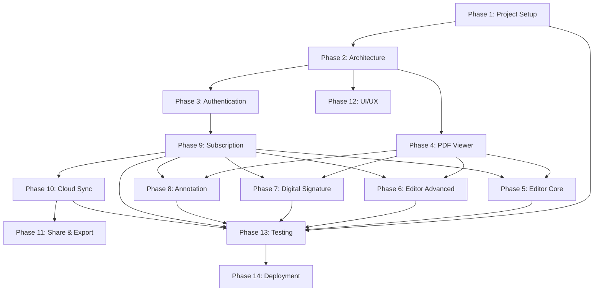

# Implementation Plan: PDF Enterprise Suite

## Overview

PDF Enterprise Suite adalah aplikasi PDF all-in-one cross-platform (iOS, Android, Web) dengan model freemium. Implementation plan ini mencakup 52 tugas yang dikelompokkan dalam 14 fase, dengan estimasi total 20-35 minggu.

---

## Tasks

### Phase 1: Project Setup & Infrastructure

- [x] 1. Initialize Flutter project dengan clean architecture structure, configure dependencies di pubspec.yaml, setup iOS/Android/Web targets, dan configure GitHub Actions CI/CD pipeline

- [ ] 2. Setup Firebase project dengan Authentication, Firestore, Cloud Storage, dan Cloud Functions. Configure FlutterFire CLI dan generate firebase_options.dart

- [ ] 3. Setup RevenueCat integration untuk subscription management, configure products di App Store Connect dan Google Play Console

- [ ] 4. Setup environment configuration dengan flutter_dotenv untuk dev/staging/prod environments dan secure storage untuk API keys

### Phase 2: Core Architecture & State Management

- [ ] 5. Implement Riverpod state management dengan providers untuk user state, subscription state, dan document state

- [ ] 6. Implement go_router untuk declarative routing dengan authentication guards dan deep linking support

- [ ] 7. Implement Hive local storage dengan boxes untuk documents, annotations, signatures, dan user preferences

- [ ] 8. Implement Dio network layer dengan interceptors untuk authentication, logging, dan error handling

### Phase 3: User Authentication

- [ ] 9. Implement user registration dengan email/password validation, OAuth (Google, Apple), dan email verification

- [ ] 10. Implement user login dengan email/password, OAuth providers, secure token storage, dan automatic token refresh

- [ ] 11. Implement logout dengan Firebase Auth sign out, OAuth sign out, dan session/token cleanup

- [ ] 12. Implement user profile management dengan Firestore sync untuk UserPreferences dan UsageStats

### Phase 4: PDF Viewer Engine

- [ ] 13. Implement PDF document loading dengan pdfx package, file validation, metadata extraction, dan encrypted PDF handling

- [ ] 14. Implement PDF page rendering dengan lazy loading, LRU caching, memory management, dan background Isolates

- [ ] 15. Implement thumbnail navigation panel dengan lazy loaded thumbnails (80x100 pixels, max 20 at once)

- [ ] 16. Implement PDF viewer UI dengan zoom/scroll gestures, page indicator, jump to page, fullscreen mode, dan dark mode support

### Phase 5: PDF Editor Engine - Core Operations

- [ ] 17. Implement PDF split dengan syncfusion_flutter_pdf, range selection, chunk mode, preview, dan encrypted PDF handling

- [ ] 18. Implement PDF merge dengan multiple document selection, drag-to-reorder, preview, dan minimum 2 documents validation

- [ ] 19. Implement rotate/reorder pages dengan thumbnail grid, drag-and-drop, preview changes, undo, dan annotation/signature preservation

- [ ] 20. Implement PDF compress dengan three compression levels (Low/Medium/High), quality preservation, dan before/after size display

### Phase 6: PDF Editor Engine - Advanced Operations

- [ ] 21. Implement PDF lock/encrypt dengan AES-256 encryption, password validation (4-128 chars), permission flags, dan max 5 password attempts

- [ ] 22. Implement watermark dengan text (max 100 chars) dan image (PNG/JPEG max 5MB), position/transparency/rotation/size configuration, dan read-only protection

- [ ] 23. Implement OCR dengan google_mlkit_text_recognition, minimum 150 DPI resolution, 5 languages support, dan searchable document output

### Phase 7: Digital Signature Engine

- [ ] 24. Implement signature creation via drawing canvas dengan adjustable stroke/color, undo, dan PNG save

- [ ] 25. Implement signature creation via image upload (PNG/JPEG max 5MB) dengan cropping dan background removal

- [ ] 26. Implement signature creation via typed text dengan font selection, color, dan size adjustment

- [ ] 27. Implement signature application dengan drag-and-drop positioning, scale (25%-200%), rotation (0/90/180/270°), timestamp/user ID storage, dan max 10 signatures per Pro user

### Phase 8: Annotation Engine

- [ ] 28. Implement highlight annotation dengan text selection, color picker (RGB), dan opacity adjustment

- [ ] 29. Implement text annotation (sticky notes) dengan positioning, formatting, font/size/color selection

- [ ] 30. Implement drawing annotation dengan freehand canvas, multiple brush types, stroke width, color, dan undo/redo

- [ ] 31. Implement stamp annotation dengan predefined stamps, custom upload, positioning, dan resize/rotate

- [ ] 32. Implement annotation management dengan list view, filtering, Free tier limit (50), Pro tier limit (500), dan export/import

### Phase 9: Subscription & Feature Gating

- [ ] 33. Implement SubscriptionManager service dengan status check, feature availability, usage count tracking, dan monthly reset

- [ ] 34. Implement RevenueCat SDK integration dengan offerings, purchase flow, restore purchases, error handling, dan receipt validation

- [ ] 35. Implement feature gating dengan availability checks, upgrade prompts, usage tracking (split/merge 10/month Free), quota warnings, dan Pro limit removal

- [ ] 36. Implement subscription UI dengan tier comparison, upgrade button, pricing options, purchase flow, restore, dan subscription management

### Phase 10: Cloud Sync

- [ ] 37. Implement Google Drive integration dengan googleapis, OAuth 2.0, upload/download/list/delete operations

- [ ] 38. Implement iCloud integration dengan CloudKit container, upload/download/list/sync operations

- [ ] 39. Implement CloudSyncService dengan sync operations, conflict resolution (local-wins/cloud-wins/manual), timeouts, offline queue (max 100), retry logic, dan real-time status Stream

- [ ] 40. Implement cloud sync UI dengan provider connection, sync status, manual sync trigger, cloud documents list, dan conflict resolution UI

### Phase 11: Share & Export

- [ ] 41. Implement share functionality dengan share_plus, system share sheet (within 500ms), support for messaging/email apps, dan annotation inclusion

- [ ] 42. Implement export functionality dengan PDF format, device storage save, location selection, dan success/error notifications

- [ ] 43. Implement shareable link generation dengan cloud upload, 7-day validity, clipboard copy, dan direct app sharing

### Phase 12: UI/UX Implementation

- [ ] 44. Implement design system dengan color palette, typography scale, light/dark themes, custom widgets library, spacing, dan accessibility support

- [ ] 45. Implement dark mode dengan system theme detection, manual toggle, preference storage, instant apply (within 500ms), dan high contrast text

- [ ] 46. Implement dashboard screen dengan recent documents, quick actions, categories, search, sync status, subscription status, dan FAB for new document

- [ ] 47. Implement settings screen dengan account, appearance, cloud sync, document settings, about, support sections, dan ads toggle

### Phase 13: Testing & Quality Assurance

- [ ] 48. Write unit tests untuk all business logic dan services (PDFViewerEngine, PDFEditorEngine, AnnotationEngine, DigitalSignatureEngine, SubscriptionManager, CloudSyncService) dengan minimum 80% coverage

- [ ] 49. Write widget tests untuk all UI components (authentication, viewer, editor, subscription, settings screens) dengan interaction dan state testing

- [ ] 50. Write integration tests untuk critical user flows (login, document open/view, split/merge, signature, subscription, cloud sync) on iOS/Android

- [ ] 51. Conduct performance testing untuk PDF open time (<1s for <50 pages), scroll (60fps), zoom (<100ms), split (<2s for 100 pages), merge (<5s for 10 docs), OCR (<2s per page), dan memory profiling

### Phase 14: Deployment & Release

- [ ] 52. Prepare app store assets (icons, launch screens, screenshots, videos, descriptions, privacy policy, terms)

- [ ] 53. Configure App Store Connect dengan bundle ID, metadata, categories, age rating, in-app purchases, dan review information

- [ ] 54. Configure Google Play Console dengan package name, metadata, categories, content rating, in-app products, dan store listing

- [ ] 55. Setup Firebase production environment dengan tightened security rules, indexes, deployed functions, analytics, crashlytics, dan remote config

- [ ] 56. Build and submit apps ke App Store Connect (iOS), Google Play Console (Android), dan deploy web build to Firebase Hosting

---

## Notes

- **Total Tasks**: 56 tasks across 14 phases
- **Estimated Timeline**: 20-35 weeks (5-9 months)
- **Dependencies**: Phase 1 → Phase 2 → Phase 3 → Phase 4 → Phases 5-8 (parallel) → Phase 9 → Phase 10 → Phase 11. Phase 12 runs parallel throughout. Phase 13-14 are final phases.
- **Critical Path**: Project Setup → Architecture → Authentication → PDF Viewer → Subscription → Cloud Sync → Testing → Deployment
- **Free vs Pro Features**: All Pro-only features require Subscription implementation (Phase 9) before feature development

---

## Task Dependency Graph



```json
{
  "waves": [
    {
      "name": "Wave 1: Foundation",
      "tasks": [1, 2, 3, 4, 5, 6, 7, 8],
      "description": "Project setup, architecture, dan state management"
    },
    {
      "name": "Wave 2: Core Features",
      "tasks": [9, 10, 11, 12, 13, 14, 15, 16],
      "description": "Authentication dan PDF Viewer"
    },
    {
      "name": "Wave 3: Editor Operations",
      "tasks": [17, 18, 19, 20, 21, 22, 23],
      "description": "PDF editing operations (split, merge, compress, encrypt, watermark, OCR)"
    },
    {
      "name": "Wave 4: Signature & Annotation",
      "tasks": [24, 25, 26, 27, 28, 29, 30, 31, 32],
      "description": "Digital signature dan annotation systems"
    },
    {
      "name": "Wave 5: Subscription & Sync",
      "tasks": [33, 34, 35, 36, 37, 38, 39, 40],
      "description": "Subscription management dan cloud sync"
    },
    {
      "name": "Wave 6: Integration & UI",
      "tasks": [41, 42, 43, 44, 45, 46, 47],
      "description": "Share/export, UI/UX implementation"
    },
    {
      "name": "Wave 7: Quality & Release",
      "tasks": [48, 49, 50, 51, 52, 53, 54, 55, 56],
      "description": "Testing, deployment, dan release"
    }
  ]
}
```

**Dependency Explanation:**
- Phase 1 (Setup) is the foundation for all subsequent phases
- Phase 2 (Architecture) must complete before any feature development
- Phase 3 (Authentication) is required for Phase 9 (Subscription) which gates all Pro features
- Phase 4 (PDF Viewer) is the core component required for all editor phases (5-8)
- Phase 9 (Subscription) must complete before Pro features can be enforced in Phases 5-8
- Phase 10 (Cloud Sync) depends on both Authentication and Subscription
- Phase 12 (UI/UX) can run in parallel but needs Architecture foundation
- Phase 13 (Testing) runs throughout and intensifies near completion
- Phase 14 (Deployment) is the final phase after all testing passes
